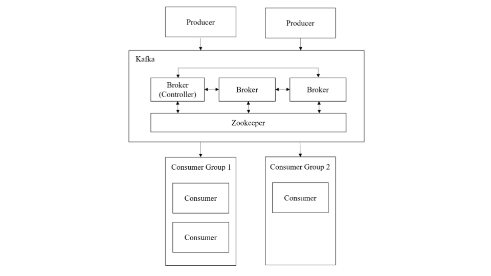
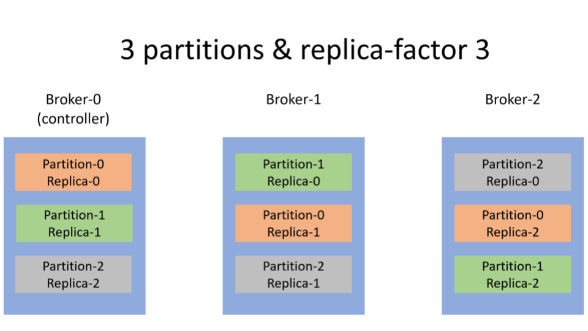
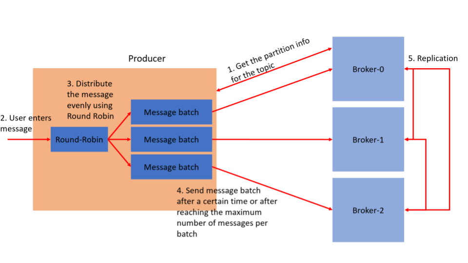
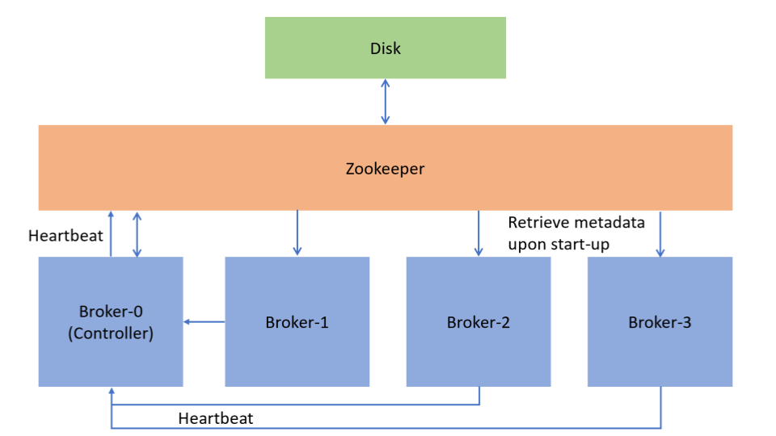
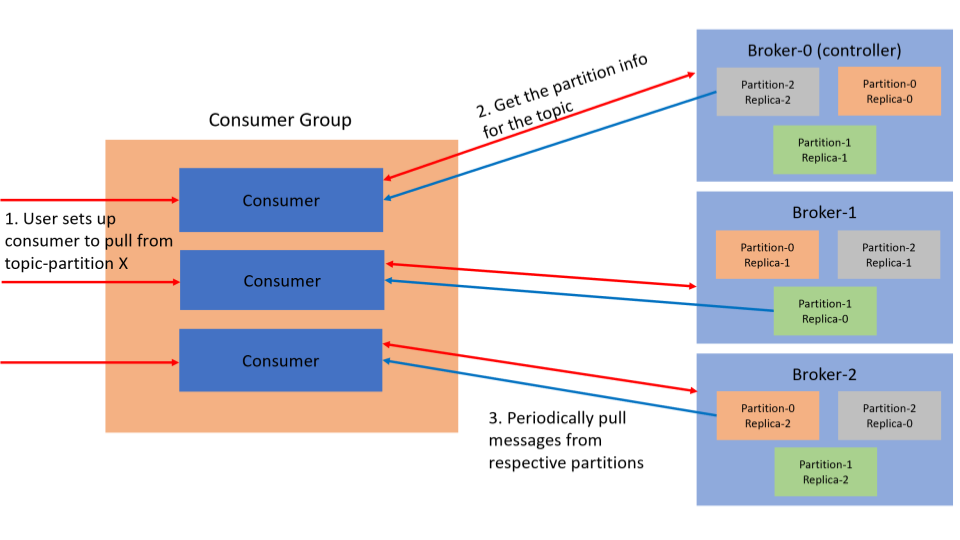

# AKFAK using Golang

This project showcase the model after Apache Kafka. 

#### Overview of system architecture
---

#### There are 4 main roles in the system.
---
1. Zookeeper
2. Producer
3. Broker
4. Consumer

#### General flow of the system
---
Producer will produce messages to the Kafka system which comprises of multiple brokers and a zookeeper. And before the producer produce the message, the producer has to create a topic first and it will specify the number of partitions and replicas for those partitions the topic will have. So if a topic with 3 partitions are created, then there will be partition 0, partition 1, partition 2. Then if the replication factor is 3, for every partition there will be 3 replicas.

##### Broker Setup

---

After the topic is created, then it can fetch the partition information for the topic and start producing messages. So the producer will round-robin through the partitions, that means the first message batch it sends will be to broker-0, then next message-batch to broker-1, and so on. This allows for load-balancing amongst the brokers in handling of messages.

#### Producer Process

---

In the implementation there is 4 brokers and 1 zookeeper. The brokers will store the messages from the producer and there’s a controller broker who will manage the assignment of partitions and replicas, including reassigning partition when a broker is down.

The Zookeeper is like a master node that will check on whether the brokers are alive and elect a new controller broker if the controller broker is down. Zookeeper will also handles the persistent storage for broker metadata. 

#### Zookeeper

---

Lastly, the consumers in consumer group, a consumer group can subscribe to a topic, then it will manage which consumers in its group will pull from which partition on that topic. In our implementation, we will do this manually, so the consumers will specify the topic and the partition they will pull from. The point of the consumer group is so that there is distribution of the pulling of messages, so not just one machine will be responsible for pulling and processing the messages. 

#### Consumer Process**

---

---

### How to run
We use Docker to demonstrate how the system will work with multiple machines.
1. Download the repository using `git clone https://github.com/TAYTS/AKFAK.git`, extract it.
2. `docker-compose build` 
3. After step 2 is complete, open 3 terminals.

#### On the first terminal, we will set up our zookeeper and brokers.
| Command            | Explanation             |
| --------------     | ----------------        |
|`docker-compose up` | This will set up the the zookeeper and 4 brokers. |

As there are 4 brokers, in the commands below, `X` in `<broker-X:port>` can be substituted by any number from \[1-4]. Port is specified in the `broker_X_config.json` files to be `5000`.

#### On the second terminal, we will create a topic and start a producer instance that will produce messages for a specified topic.
| Command            | Explanation             |
| --------------     | ----------------        |
|`docker container run --rm  -it --network=kafka-net akfak bash`| This runs a bash terminal in a container in the network that is set up. |
| `admin-topic -kafka-server <broker-X:port> create -topic <topic_name> -partitions <num_partitions> -replica-factor <num_replicas>` | Creates a topic with `<topic_name>` with `<num_partitions>` partitions and `<num_replicas>` replicas.  **Example**: `admin-topic -kafka-server broker-1:5000 create -topic topic1 -partitions 3 -replica-factor 3` |
|`producer --kafka-server broker-X:port --topic <topic_name>` | This instantiates a producer. The producer will call the given broker address to retrieve partition information on the topic it is producing. **Example**: `producer --kafka-server broker-1:5000 --topic topic1`|

#### On the third terminal, we will create a consumer instance and pull data from a specified topic and partition.
| Command            | Explanation             |
| --------------     | ----------------        |
|`docker container run --rm  -it --network=kafka-net akfak bash` | This runs a bash terminal in a container in the network that is set up. |
|`consumer --id <id> --kafka-server <broker-X:port> --topic <topic_name>` | This instantiates a consumer. The consumer will call the given broker address to retrieve partition information on the topic it is producing. The user will then select one partition the consumer will pull from. **Example**: `consumer --id 1 --kafka-server broker-1:5000 --topic topic1`|

